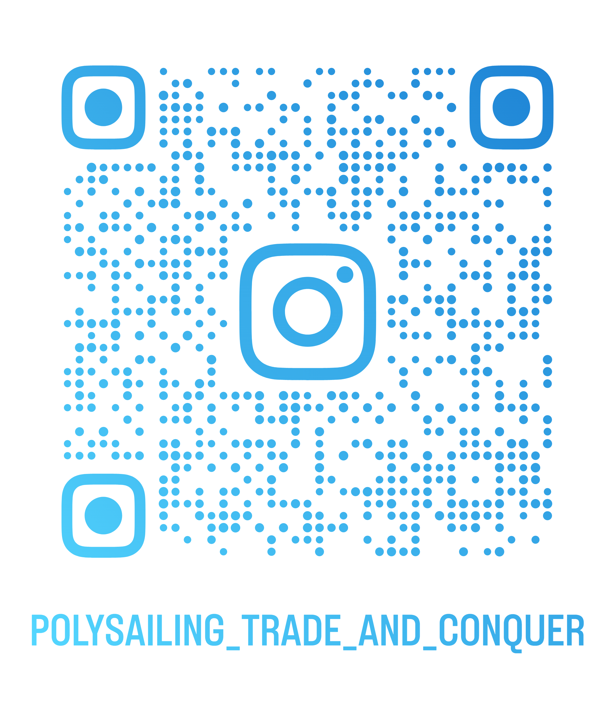

# ⚓ PolySailing: Trade & Conquer

A stylized low-poly naval adventure built in Unity.  
Sail across modular worlds, trade between ports, and conquer the seas!

Follow our development journey, see new ships, ports, and gameplay:

---

## 🧭 About the Project

- Low-poly naval world
- Player and NPC ships, trading, and cannon combat
- Modular water and buoyancy system in URP
- Focus: fluid movement, ocean atmosphere, and scalable systems

---

## 🛠 Technical Stack

- **Engine:** Unity (URP)  
- **Language:** C#  
- **Hosting:** GitHub Pages + Cloudflare  
- **Repository:** [https://github.com/KralMiroslav/polysailing-trade-conquer](https://github.com/KralMiroslav/polysailing-trade-conquer)

---

## 📬 Contact

🌍 **Website:** https://polysailing.com  
📸 **Instagram:** https://www.instagram.com/polysailing_trade_and_conquer/  
✉️ **Contact:** support@polysailing.com

---
<!-- SOCIAL / CONTACT CARD -->
<section style="max-width: 960px; margin: 3rem auto; padding: 2.5rem 1.5rem; background: #ffffff; border-radius: 24px; box-shadow: 0 18px 50px rgba(0,0,0,.05); text-align: center; font-family: system-ui, -apple-system, BlinkMacSystemFont, 'Segoe UI', sans-serif;">
  <!-- Profile image -->
  
  
  <h2 style="font-size:1.9rem; margin-bottom:0.25rem;">PolySailing: Trade &amp; Conquer</h2>
  

    Stylized low-poly naval adventure • Unity • Sailing • Trading • Combat
  

  <!-- Buttons -->
  

    <a href="https://polysailing.com" style="background:#0077ff; color:#fff; padding:0.6rem 1.4rem; border-radius:9999px; text-decoration:none; font-weight:600;">🌍 Website</a>
    <a href="https://www.instagram.com/polysailing_trade_and_conquer/" target="_blank" rel="noreferrer" style="background:#ffffff; border:1px solid #d1e6ff; color:#0077ff; padding:0.6rem 1.4rem; border-radius:9999px; text-decoration:none; font-weight:500;">📸 Instagram</a>
    <a href="mailto:support@polysailing.com" style="background:#ffffff; border:1px solid #d1e6ff; color:#0077ff; padding:0.6rem 1.4rem; border-radius:9999px; text-decoration:none; font-weight:500;">✉️ Contact</a>
  

  <!-- QR -->
  
Scan the QR code to follow our updates:

  

  

    @polysailing_trade_and_conquer
  

</section>
